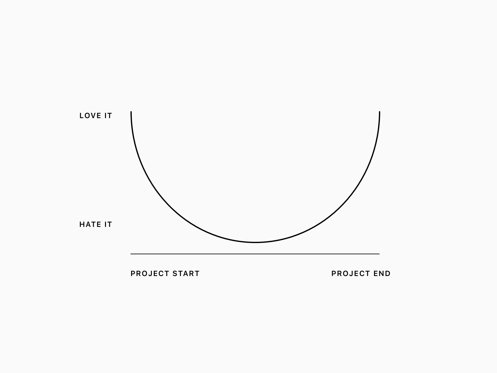
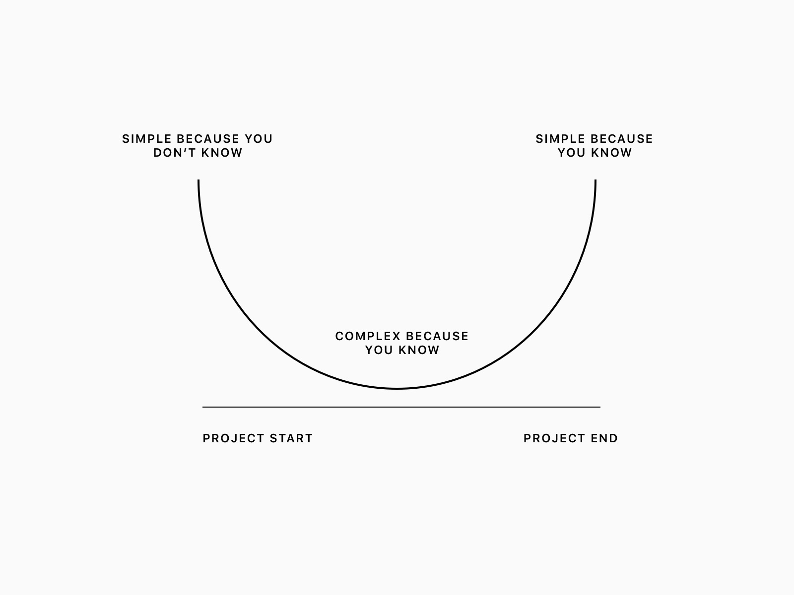
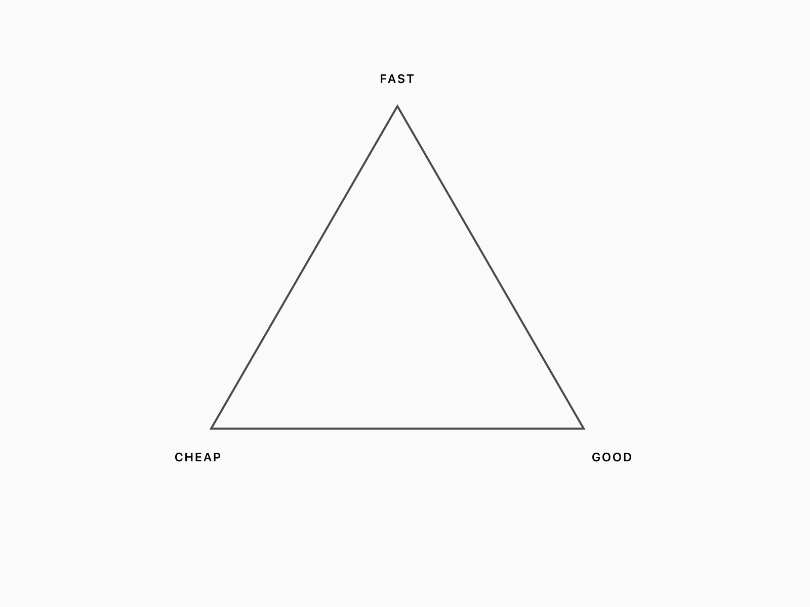
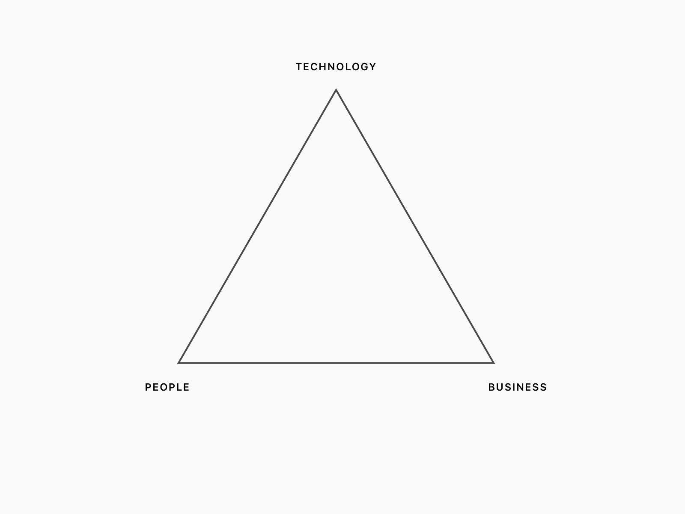
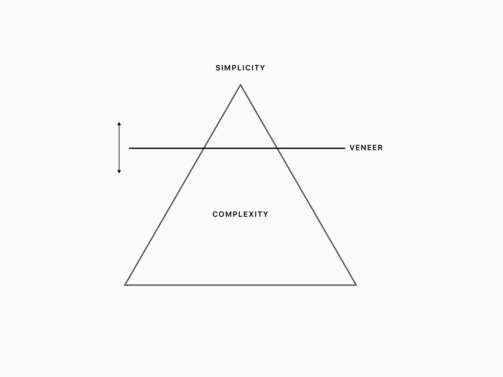
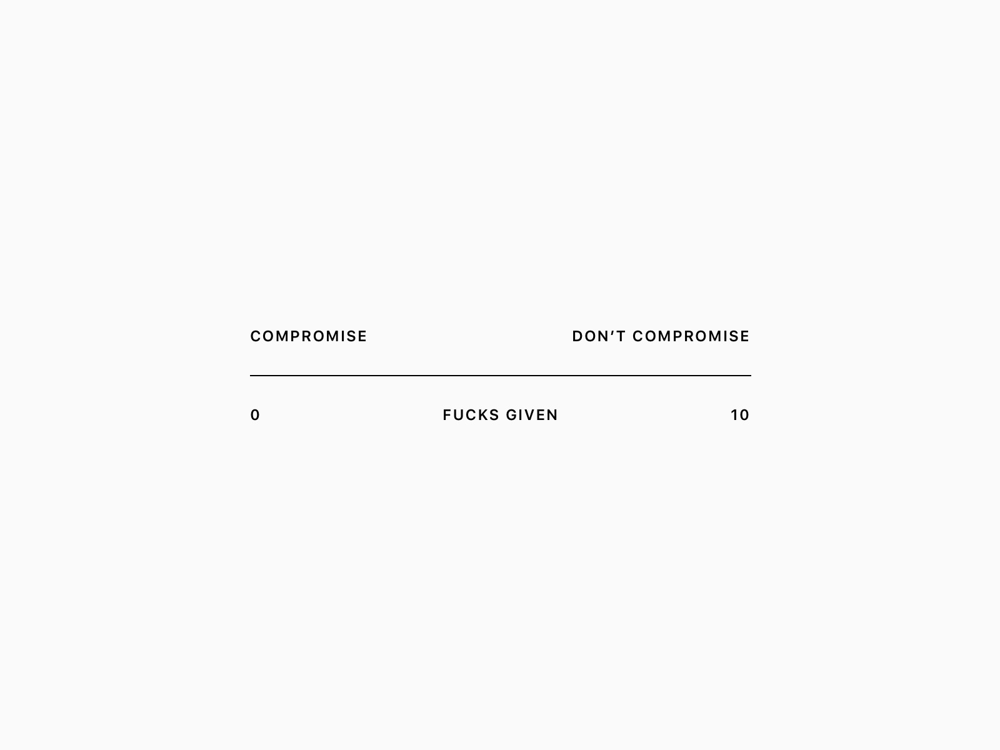
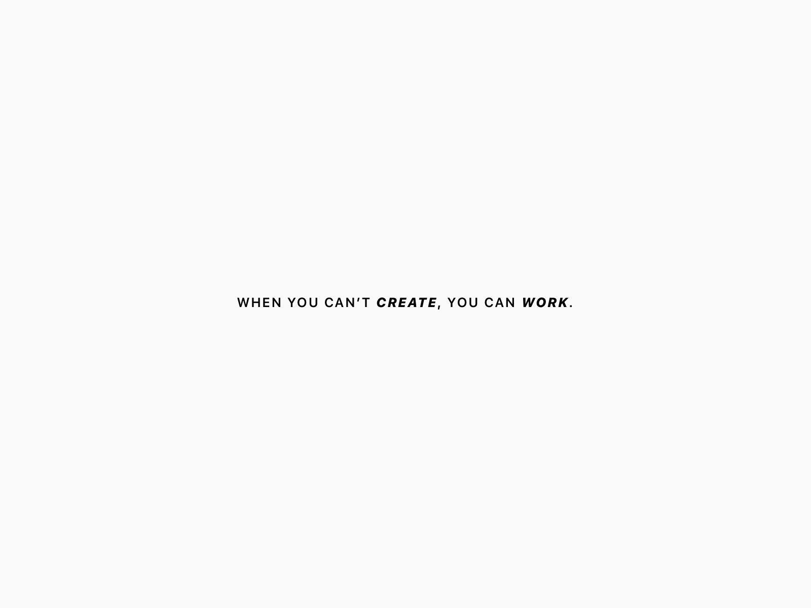
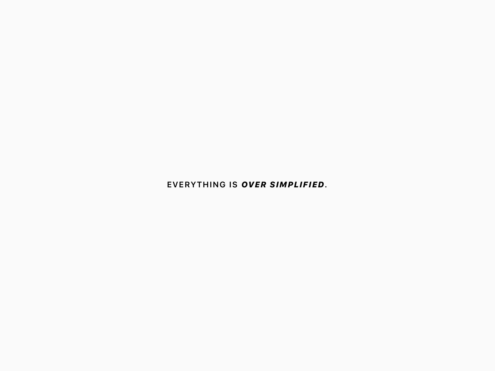

 

 

Most decisions are made using information from three places

   

 

As projects progress

    

 

Probable cause — the middle is hard

    

 

Pick two

    

 

Pillars of design

    

 

There is a vaneer between perceived and obscured complexity

    

 

On choosing your battles, from <a href="http://blog.capwatkins.com/the-sliding-scale-of-giving-a-fuck">Cap Watkins</a>

    

 

From <a href="http://academicmuse.org/11-commandments-for-writing-by-henry-miller/">Henry Miller's 11 commandments of writing</a>

    

 

    

 
